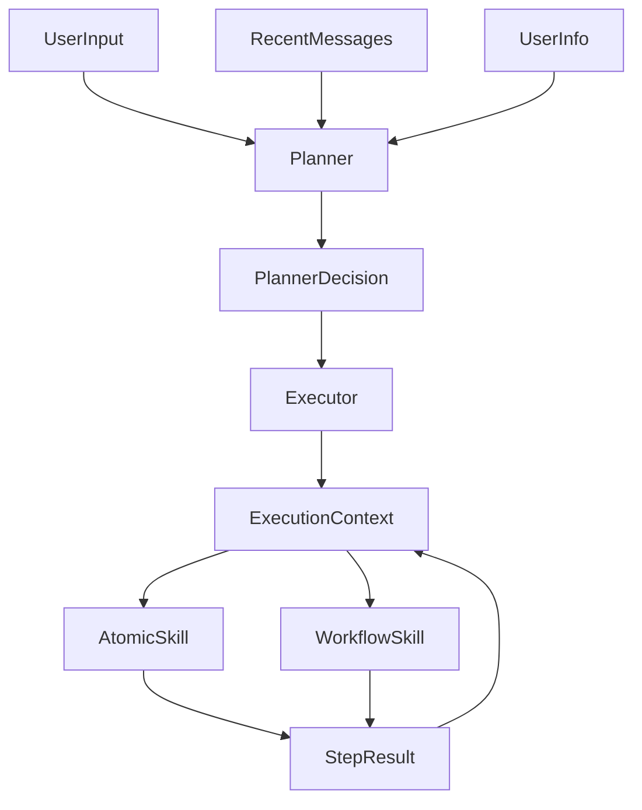

# ACGAgent 图数据库维护系统

这是一个基于 `FastAPI + SQLite + Neo4j + Vue3` 的图数据库维护系统骨架项目，重点在于提供一套清晰、可扩展、易维护的单 Agent 架构。当前版本已经落地了配置层、关系型数据模型、鉴权模块、对话模块、Planner/Executor/Skill 最小闭环、Neo4j 抽象层，以及 Vue3 的基础交互界面。

## 1. 技术栈

- 后端：`Python 3.11`、`FastAPI`、`SQLAlchemy`、`SQLite`
- 图数据库：`Neo4j`
- 前端：`Vue 3`、`Vite`、`TypeScript`、`Pinia`、`Vue Router`
- 认证：`JWT`

## 2. 当前功能范围

- 统一配置：所有配置统一从 `.env` 读取，并提供 [`.env.example`](.env.example)
- 鉴权模块：
  - 用户注册：邮箱 + 密码
  - 用户登录
  - 刷新令牌
  - 用户登出
  - 获取当前用户信息
  - 修改个人信息：邮箱 / 密码
  - `role` 注册时固定为 `user`，你可在 SQLite 数据库中手动改为 `admin`
- 对话模块：
  - 创建对话
  - 重命名对话标题
  - 删除对话
  - 查看对话列表
  - 查看对话详情
  - 发送消息并触发 Agent 执行
- 古籍管理模块：
  - 仅管理员可访问
  - 支持 `md` / `docx` 上传
  - 支持手工输入 `title + context`
  - 每篇文章触发一次固定 workflow
  - 在上传页 / 输入页内查看最近任务与步骤状态
- Agent 核心：
  - Planner 负责识别意图，并路由到已注册的 Skill / Workflow
  - Executor 负责执行并维护统一上下文 `ExecutionContext`
  - 每一步执行结果会写入上下文与关系型数据库
- Skill 系统：
  - Skill metadata 存储在 SQLite
  - Skill script 按 `atomic / workflow` 目录组织
  - 提供内置注册器，后续可继续增删改查
- 图数据库层：
  - 已封装 Neo4j 连接管理与统一读写接口
  - 当前图操作是占位实现，方便后续进一步下沉为 Skill
- 前端：
  - 登录页
  - 注册页
  - 对话页
  - 个人设置页
  - 亮色风格侧边导航

## 3. 项目结构

```text
ACGAgent/
├─ backend/
│  ├─ app/
│  │  ├─ api/                   # FastAPI 路由层
│  │  ├─ core/                  # 配置、安全、依赖注入
│  │  ├─ db/                    # SQLAlchemy 基础设施
│  │  ├─ models/                # SQLite ORM 模型
│  │  ├─ schemas/               # Pydantic 数据模型
│  │  ├─ services/              # 业务逻辑层
│  │  ├─ agents/                # Planner / Executor / Context
│  │  ├─ skills/                # Atomic / Workflow Skill 与注册器
│  │  ├─ llm/                   # 多供应商 LLM 抽象层
│  │  ├─ graph/                 # Neo4j 抽象层
│  │  └─ main.py                # FastAPI 入口
│  └─ tests/                    # 基础测试
├─ frontend/
│  ├─ src/
│  │  ├─ api/                   # 前端请求封装
│  │  ├─ components/            # 可复用组件
│  │  ├─ layouts/               # 页面布局
│  │  ├─ router/                # 路由
│  │  ├─ stores/                # Pinia 状态管理
│  │  └─ views/                 # 页面
├─ .env.example
├─ requirements.txt
└─ README.md
```

## 4. 后端架构说明

### 4.1 配置层

- 文件：[`backend/app/core/config.py`](backend/app/core/config.py)
- 说明：所有模块只通过 `Settings` 对象读取配置，不在业务代码中直接访问环境变量。

### 4.2 关系型数据模型

当前核心数据模型包括：

- `User`：用户信息
- `AuthSession`：Refresh Token 会话
- `Conversation`：对话
- `Message`：消息
- `ConversationMemory`：短期记忆摘要与窗口配置
- `SkillDefinition`：Skill 元数据
- `SkillRelation`：Skill 依赖关系
- `PlannerDecisionRecord`：Planner 决策记录
- `ExecutionRun`：一次完整执行
- `ExecutionStepRun`：执行中的每一步
- `Passage`：古籍文章实体

### 4.3 Agent 执行机制

系统采用单 Agent 架构，但执行链路是受控的，不能自由生成多步执行计划。



关键约束如下：

- Planner 只能从“已有 Skill / Workflow”中做选择
- 不允许 LLM 自由生成多步计划
- Workflow 只能调用已注册的 Atomic Skill 或 Workflow Skill
- 写类 Skill 需要经过 `role` 校验，当前仅 `admin` 可调用

### 4.4 Skill 设计

- Skill metadata 放在 SQLite 中
- Skill script 放在文件系统中：
  - [`backend/app/skills/atomic`](backend/app/skills/atomic)
  - [`backend/app/skills/workflow`](backend/app/skills/workflow)
- 注册器文件：[`backend/app/skills/registry.py`](backend/app/skills/registry.py)

当前内置 Skill：

- `conversation_reply_atomic`
- `graph_query_atomic`
- `graph_write_atomic`
- `conversation_reply_workflow`
- `passage_preprocess_atomic`
- `passage_store_sqlite_atomic`
- `passage_store_graph_atomic`
- `passage_ingestion_workflow`

### 4.5 图数据库抽象层

- 文件：
  - [`backend/app/graph/client.py`](backend/app/graph/client.py)
  - [`backend/app/graph/repository.py`](backend/app/graph/repository.py)
- 当前职责：
  - 管理 Neo4j Driver 生命周期
  - 向上提供统一 `run_read_query()` / `run_write_query()` 接口
  - 暂时返回占位结果，为后续 Skill 扩展预留入口

## 5. 前端说明

前端采用简洁亮色风格，当前页面包括：

- 登录页：[`frontend/src/views/LoginView.vue`](frontend/src/views/LoginView.vue)
- 注册页：[`frontend/src/views/RegisterView.vue`](frontend/src/views/RegisterView.vue)
- 对话页：[`frontend/src/views/ChatView.vue`](frontend/src/views/ChatView.vue)
- 个人设置页：[`frontend/src/views/ProfileView.vue`](frontend/src/views/ProfileView.vue)
- 古籍上传页：[`frontend/src/views/PassageUploadView.vue`](frontend/src/views/PassageUploadView.vue)
- 古籍输入页：[`frontend/src/views/PassageManualInputView.vue`](frontend/src/views/PassageManualInputView.vue)

导航布局位于：

- [`frontend/src/layouts/AppLayout.vue`](frontend/src/layouts/AppLayout.vue)
- [`frontend/src/components/AppSidebar.vue`](frontend/src/components/AppSidebar.vue)

## 6. 环境变量说明

请先复制 [`.env.example`](.env.example) 为 `.env`，再根据本地环境修改：

- `APP_*`：FastAPI 应用基础配置
- `SQLITE_DATABASE_URL`：SQLite 数据库地址
- `NEO4J_*`：Neo4j 连接配置
- `JWT_*`：JWT 令牌配置
- `CONVERSATION_MEMORY_WINDOW`：短期记忆窗口大小
- `LLM_*`：外部 LLM 供应商配置
- `VITE_API_BASE_URL`：前端调用后端的 API 地址

当前推荐的 DeepSeek 配置为：

- `LLM_PROVIDER=deepseek`
- `LLM_MODEL_NAME=deepseek-chat`
- `LLM_API_BASE_URL=https://api.deepseek.com`
- `LLM_API_KEY=你的 DeepSeek 密钥`

## 7. 本地启动

### 7.1 后端

建议先准备 Python 3.11 虚拟环境，然后执行：

```bash
pip install -r requirements.txt
```

如果当前环境已经装过较新的 `bcrypt`，建议额外执行一次：

```bash
pip install "bcrypt==4.0.1" --force-reinstall
```

启动命令：

```bash
uvicorn app.main:app --app-dir backend --reload
```

启动后默认访问：

- 后端接口文档：[http://localhost:8000/docs](http://localhost:8000/docs)

当前新增的主要接口包括：

- `PATCH /api/v1/chat/conversations/{conversation_id}`：重命名会话
- `DELETE /api/v1/chat/conversations/{conversation_id}`：删除会话
- `POST /api/v1/passages/upload`：上传古籍文件，仅 admin
- `POST /api/v1/passages/manual`：手工输入古籍，仅 admin
- `GET /api/v1/passages`：查看古籍列表，仅 admin
- `GET /api/v1/passages/{doc_id}/runs`：查看 workflow 任务和步骤，仅 admin

### 7.2 前端

进入前端目录后执行：

```bash
npm install
npm run dev
```

默认访问：

- 前端页面：[http://localhost:5173](http://localhost:5173)

## 8. 如何新增 Skill

后续要新增 Skill 时，建议遵守以下步骤：

1. 在 [`backend/app/skills/atomic`](backend/app/skills/atomic) 或 [`backend/app/skills/workflow`](backend/app/skills/workflow) 新建脚本文件。
2. 让 Skill 类继承 [`backend/app/skills/base.py`](backend/app/skills/base.py) 中的 `BaseSkill`。
3. 为 Skill 指定：
   - `code`
   - `allowed_roles`
   - `run()` 方法
4. 在 [`backend/app/skills/registry.py`](backend/app/skills/registry.py) 中注册实例与 metadata。
5. 如果需要固定业务流程，优先封装为 Workflow Skill，而不是让 Planner 自由编排。

## 9. 已知限制

- 当前运行环境内没有可用的 `python` / `py` 命令，因此本次实现无法在该机器上实际启动后端服务，只能完成代码与静态结构搭建。
- Neo4j 操作目前是占位实现，后续需按你的 Skill 设计逐步补齐。
- LLM 多供应商接口已预留，当前已接入 `DeepSeek`，并保留 `mock provider` 作为失败兜底。
- 当前数据库迁移仍使用 `create_all`，后续建议切换到 `Alembic`。

## 10. 测试

当前提供基础测试文件：

- [`backend/tests/test_planner_executor.py`](backend/tests/test_planner_executor.py)

建议在具备 Python 3.11 环境后执行：

```bash
pytest backend/tests
```
